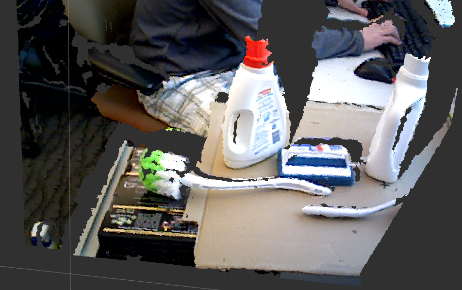
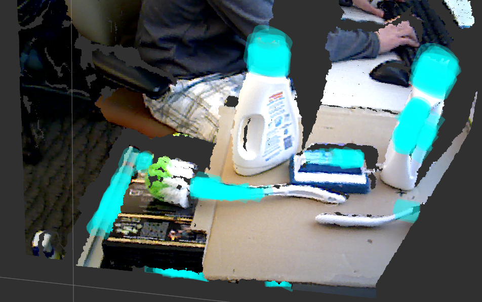

# Handle Detector

**Author:** Andreas ten Pas (atp@ccs.neu.edu)

**Version:** 1.0.0

**Wiki:** http://wiki.ros.org/handle_detector

**Author's Website:** http://www.ccs.neu.edu/home/atp/

## OVERVIEW

This package takes a point cloud as input and produces a list of handels / enveloping grasp affordances as output.

### Input: point cloud

### Output: handles / enveloping grasp affordances

## REQUIREMENTS

1. ROS Hydro (http://wiki.ros.org/hydro)
2. Lapack (install in Ubuntu using: sudo apt-get install liblapack-dev)
3. Openni_launch (http://wiki.ros.org/openni_launch; install in Ubuntu using: sudo apt-get install ros-hydro-openni-launch)

## INSTRUCTIONS

Please look at http://wiki.ros.org/handle_detector for detailed instructions.
